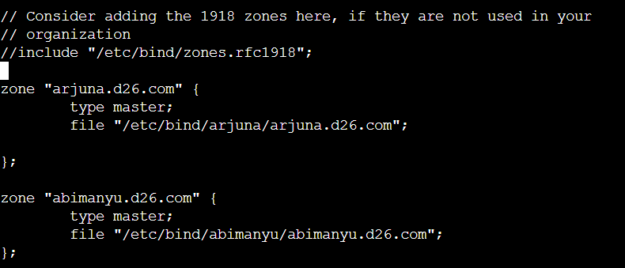

# Jarkom-Modul-2-D26-2023

* Fathan Abi Karami (5025211156)
* Alya Putri Salma (5025211174)

# Soal 1
Yudhistira akan digunakan sebagai DNS Master, Werkudara sebagai DNS Slave, Arjuna merupakan Load Balancer yang terdiri dari beberapa Web Server yaitu Prabakusuma, Abimanyu, dan Wisanggeni. Buatlah topologi dengan pembagian sebagai berikut. Folder topologi dapat diakses pada drive berikut 


## pengerjaan
buat topologi sesuai gambar


configure network tiap node

Pandudewanata:
``` txt
auto eth0
iface eth0 inet dhcp

auto eth1
iface eth1 inet static
	address 192.204.1.1
	netmask 255.255.255.0

auto eth2
iface eth2 inet static
	address 192.204.2.1
	netmask 255.255.255.0

auto eth3
iface eth3 inet static
	address 192.204.3.1
	netmask 255.255.255.0
```
DNSMASTER-Yudhistira:
``` txt
auto eth0
iface eth0 inet static
	address 192.204.1.2
	netmask 255.255.255.0
	gateway 192.204.1.1
```
DNSSLAVE-Werkudara:
``` txt
auto eth0
iface eth0 inet static
	address 192.204.1.3
	netmask 255.255.255.0
	gateway 192.204.1.1
```
Client-Nakula:
``` txt
auto eth0
iface eth0 inet static
	address 192.204.2.2
	netmask 255.255.255.0
	gateway 192.204.2.1
```
Client-Sadewa:
``` txt
auto eth0
iface eth0 inet static
	address 192.204.2.3
	netmask 255.255.255.0
	gateway 192.204.2.1
```
Arjuna:
``` txt
auto eth0
iface eth0 inet static
	address 192.204.3.2
	netmask 255.255.255.0
	gateway 192.204.3.1
```
Abimanyu:
``` txt
auto eth0
iface eth0 inet static
	address 192.204.3.3
	netmask 255.255.255.0
	gateway 192.204.3.1
```
Prabukusuma:
``` txt
auto eth0
iface eth0 inet static
	address 192.204.3.4
	netmask 255.255.255.0
	gateway 192.204.3.1
```
Wisanggeni
``` txt
auto eth0
iface eth0 inet static
	address 192.204.3.5
	netmask 255.255.255.0
	gateway 192.204.3.1
```

pada pandudewanata buat script start.sh untuk konfigurasi 

start.sh:


cari IP DNS dengan menngunakan
``` bash
cat /etc/resolv.conf
```
didapat 
``` txt
nameserver 192.168.122.1
```
pada semua node buat script start.sh berisikan:


## Testing
lakukan testing dengan melakukan ping google.com


didapat bahwa dapat terhubung ke internet

# Soal 2 dan 3
Buatlah website utama pada node arjuna dengan akses ke arjuna.yyy.com dengan alias www.arjuna.yyy.com dengan yyy merupakan kode kelompok

## Pengerjaan:
pada node DNSMASTER-Yudhistira modifikasi script start.sh untuk menginsitall bind9

start.sh:


jalankan script. kemudian buat konfigurasi named.conf.local. copy named.conf.local dari /etc/bind9/named.conf.local ke /root agar konfigurasi tidak hilang. modifikasi named.conf.local di root



buat script confWeb.sh untuk mengkonfigurasi arjuna dan abimanyu

kemudian pada confWeb.sh tambahkan command untuk men-copy kembali ke /etc/bind.

pada confWeb.sh tambahkan command mkdir untuk membuat direktori arjuna dan abimanyu dan copy /etc/bind/db.local ke kedua direktori dengan nama arjuna.d26.com dan abimanyu.d26.com yang telah dibuat. copy kembali arjuna.d26.com dan abimanyu.d26.com ke /root agar tidak hilang. kemudian modifikasi keduanya yang ada di root

arjuna.d26.com:


abimanyu.d26.com:


kemudian copy kembali keduanya ke direktori arjuna dan abimnayu dan restart service bind9

script confWeb.sh:


jalankan confWeb.sh

pada client nakula dan sadewa modifikasi script untuk menambahkan Yudhistira sebagai DNSMASTER


## Testing
ping arjuna.d26.com


Ping www.arjuna.d26.com


ping abimanyu.d26.com


ping www.abimanyu.d26.com


