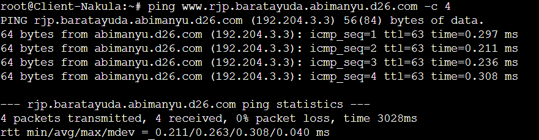
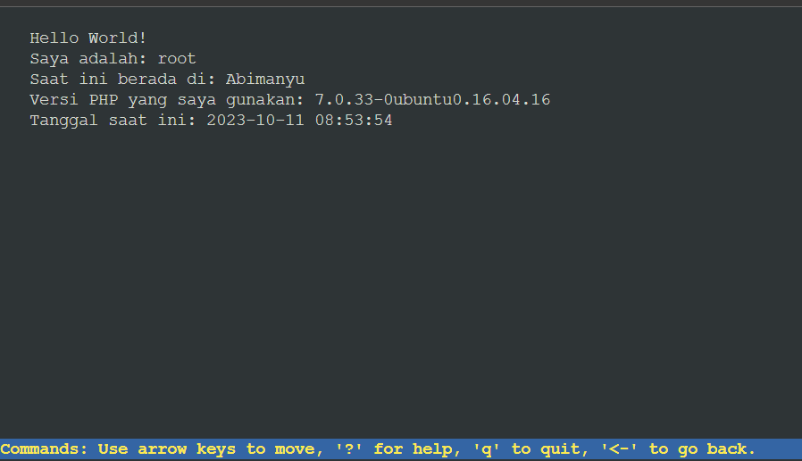
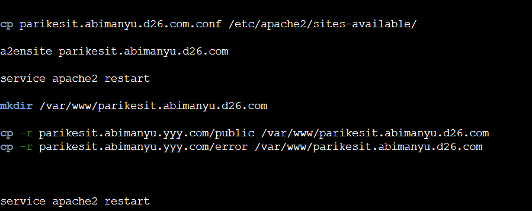
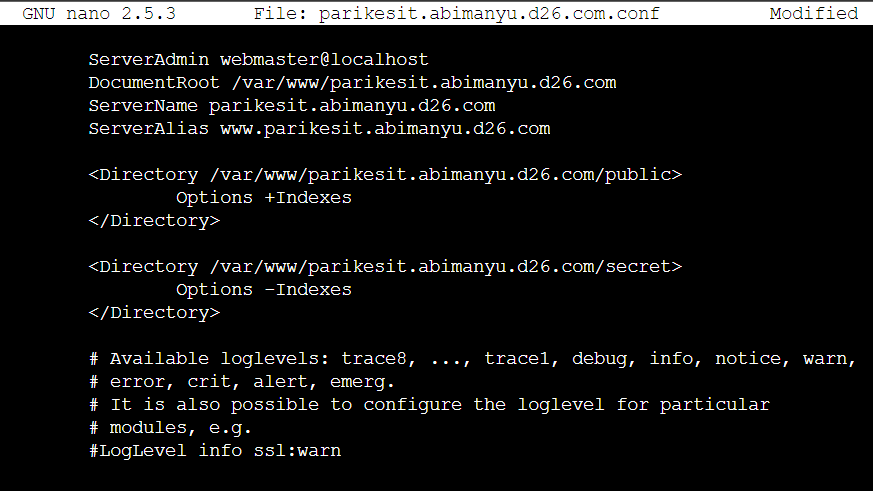

# Jarkom-Modul-2-D26-2023

* Fathan Abi Karami (5025211156)
* Alya Putri Salma (5025211174)

# Soal 1
Yudhistira akan digunakan sebagai DNS Master, Werkudara sebagai DNS Slave, Arjuna merupakan Load Balancer yang terdiri dari beberapa Web Server yaitu Prabakusuma, Abimanyu, dan Wisanggeni. Buatlah topologi dengan pembagian sebagai berikut. Folder topologi dapat diakses pada drive berikut 


## pengerjaan
buat topologi sesuai gambar


configure network tiap node

Pandudewanata:
``` txt
auto eth0
iface eth0 inet dhcp

auto eth1
iface eth1 inet static
	address 192.204.1.1
	netmask 255.255.255.0

auto eth2
iface eth2 inet static
	address 192.204.2.1
	netmask 255.255.255.0

auto eth3
iface eth3 inet static
	address 192.204.3.1
	netmask 255.255.255.0
```
DNSMASTER-Yudhistira:
``` txt
auto eth0
iface eth0 inet static
	address 192.204.1.2
	netmask 255.255.255.0
	gateway 192.204.1.1
```
DNSSLAVE-Werkudara:
``` txt
auto eth0
iface eth0 inet static
	address 192.204.1.3
	netmask 255.255.255.0
	gateway 192.204.1.1
```
Client-Nakula:
``` txt
auto eth0
iface eth0 inet static
	address 192.204.2.2
	netmask 255.255.255.0
	gateway 192.204.2.1
```
Client-Sadewa:
``` txt
auto eth0
iface eth0 inet static
	address 192.204.2.3
	netmask 255.255.255.0
	gateway 192.204.2.1
```
Arjuna:
``` txt
auto eth0
iface eth0 inet static
	address 192.204.3.2
	netmask 255.255.255.0
	gateway 192.204.3.1
```
Abimanyu:
``` txt
auto eth0
iface eth0 inet static
	address 192.204.3.3
	netmask 255.255.255.0
	gateway 192.204.3.1
```
Prabukusuma:
``` txt
auto eth0
iface eth0 inet static
	address 192.204.3.4
	netmask 255.255.255.0
	gateway 192.204.3.1
```
Wisanggeni
``` txt
auto eth0
iface eth0 inet static
	address 192.204.3.5
	netmask 255.255.255.0
	gateway 192.204.3.1
```

pada pandudewanata buat script start.sh untuk konfigurasi 

start.sh:


cari IP DNS dengan menngunakan
``` bash
cat /etc/resolv.conf
```
didapat 
``` txt
nameserver 192.168.122.1
```
pada semua node buat script start.sh berisikan:


## Testing
lakukan testing dengan melakukan ping google.com


didapat bahwa dapat terhubung ke internet

# Soal 2 dan 3
Buatlah website utama pada node arjuna dengan akses ke arjuna.yyy.com dengan alias www.arjuna.yyy.com dengan yyy merupakan kode kelompok

Dengan cara yang sama seperti soal nomor 2, buatlah website utama dengan akses ke abimanyu.yyy.com dan alias www.abimanyu.yyy.com.


## Pengerjaan:
pada node DNSMASTER-Yudhistira modifikasi script start.sh untuk menginsitall bind9

start.sh:


jalankan script. kemudian buat konfigurasi named.conf.local. copy named.conf.local dari /etc/bind9/named.conf.local ke /root agar konfigurasi tidak hilang. modifikasi named.conf.local di root


buat script confWeb.sh untuk mengkonfigurasi arjuna dan abimanyu

kemudian pada confWeb.sh tambahkan command untuk men-copy kembali ke /etc/bind.

pada confWeb.sh tambahkan command mkdir untuk membuat direktori arjuna dan abimanyu dan copy /etc/bind/db.local ke kedua direktori dengan nama arjuna.d26.com dan abimanyu.d26.com yang telah dibuat. copy kembali arjuna.d26.com dan abimanyu.d26.com ke /root agar tidak hilang. kemudian modifikasi keduanya yang ada di root, setelah dimodifikasi copy kembali ke /etc/bind/arjuna dan /etc/bind/abimanyu 

arjuna.d26.com:


abimanyu.d26.com:


kemudian copy kembali keduanya ke direktori arjuna dan abimnayu dan restart service bind9

script confWeb.sh:


jalankan confWeb.sh

pada client nakula dan sadewa modifikasi script untuk menambahkan Yudhistira sebagai DNSMASTER


## Testing
ping arjuna.d26.com


Ping www.arjuna.d26.com


ping abimanyu.d26.com


ping www.abimanyu.d26.com


# Soal 4
Kemudian, karena terdapat beberapa web yang harus di-deploy, buatlah subdomain parikesit.abimanyu.yyy.com yang diatur DNS-nya di Yudhistira dan mengarah ke Abimanyu.

## Pengerjaan
pada abimanyu.d26.com di /root pada node yudhistira tambahkan 
``` txt
parikesit	IN	A	192.204.3.3	;
```
jalankan kembali confWeb.sh

abimanyu.d26.com:


## Testing
ping parikesit.abimanyu.d26.com


# Soal 5
Buat juga reverse domain untuk domain utama. (Abimanyu saja yang direverse)

## Pengerjaan
edit named.conf.local dengan menambahkan:


pada confWeb.sh tambahkan command untuk men-copy /etc/bind/db.local ke /etc/bind/abimanyu dengan nama 3.204.192.in-addr.arpa, kemudian copy file 3.204.192.in-addr.arpa ke root agar tidak hilang. edit 3.204.192.in-addr.arpa di root menjadi:


tambahkan comman untuk mencopy 3.204.192.in-addr.arpa dari .root ke /etc/bind/abimanyu


jalankan confWeb.sh

## Tesitng
jalankan command
``` txt
host -t PTR 192.204.3.3
```


# Soal 6
Agar dapat tetap dihubungi ketika DNS Server Yudhistira bermasalah, buat juga Werkudara sebagai DNS Slave untuk domain utama

## Pengerjaan 
Tambahkan konfigurasi named.conf.local di DNSMASTER-Yudhistira:


jalankan kembali confWeb.sh

pada node DNSSLAVE-Werkudara buat script start.sh untuk instalasi bind9

start.sh


jalankan script. kemudian buat konfigurasi named.conf.local. copy named.conf.local dari /etc/bind9/named.conf.local ke /root agar konfigurasi tidak hilang. modifikasi named.conf.local di root


buat script confWeb.sh untuk menn-copy named.conf.local dari /root ke /etc/bind/ dan restart bind9


## Testing
stop service bind9 di yudhistira:
``` txt
service bind9 stop
```


pada client edit start.sh untuk tambahkan IP DNSSLAVE-Werkudara ke /etc/resolv.conf


lakukan ping terhadap abimanyu.d26.com


# Soal 7
Seperti yang kita tahu karena banyak sekali informasi yang harus diterima, buatlah subdomain khusus untuk perang yaitu baratayuda.abimanyu.yyy.com dengan alias www.baratayuda.abimanyu.yyy.com yang didelegasikan dari Yudhistira ke Werkudara dengan IP menuju ke Abimanyu dalam folder Baratayuda.

## Pengerjaan
pada abimanyu.d26.com di node DNSMASTER-Yudhistira tambahkan konfigurasi menjadi:


kemudian edit /etc/bind/named.conf.options


copy named.conf.options dari /etc/bind ke /root agar tidak hilang.

edit script confWeb.sh untuk men-copy kembali named.conf.options dari /root ke /etc/bind


jalankan confWeb.sh

pada node DNSSLAVE-Werkudara edit /etc/bind/named.conf.options


copy named.conf.options dari /etc/bind ke /root agar tidak hilang.

edit script confWeb.sh untuk men-copy kembali named.conf.options dari /root ke /etc/bind


Edit named.conf.local, tambahkan:


pada confWeb.sh tambahkan command mkdir untuk membuat direktori baratayuda dan copy /etc/bind/db.local ke baratayuda dengan nama baratayuda.abimanyu.d26.com. copy kembali baratayuda.abimanyu.d26.com ke /root agar tidak hilang. kemudian modifikasi baratayuda.abimanyu.d26.com yang ada di root, lalu copy kembali ke /etc/bind/baratayuda

baratayuda.abimanyu.d26.com:


restart service bind9

## Testing
ping baratayuda.abimanyu.d26.com


ping www.baratayuda.abimanyu.d26.com


# Soal 8
Untuk informasi yang lebih spesifik mengenai Ranjapan Baratayuda, buatlah subdomain melalui Werkudara dengan akses rjp.baratayuda.abimanyu.yyy.com dengan alias www.rjp.baratayuda.abimanyu.yyy.com yang mengarah ke Abimanyu

## Pengerjaan:
edit baratayuda.abimanyu.d26.com pada node werkudara menjadi:


jalankan confWeb.sh

## Testing
ping rjp.baratayuda.abimanyu.d26.com


ping www.rjp.baratayuda.abimanyu.d26.com




# Soal 9 dan 10
Arjuna merupakan suatu Load Balancer Nginx dengan tiga worker (yang juga menggunakan nginx sebagai webserver) yaitu Prabakusuma, Abimanyu, dan Wisanggeni. Lakukan deployment pada masing-masing worker.

Kemudian gunakan algoritma Round Robin untuk Load Balancer pada Arjuna. Gunakan server_name pada soal nomor 1. Untuk melakukan pengecekan akses alamat web tersebut kemudian pastikan worker yang digunakan untuk menangani permintaan akan berganti ganti secara acak. Untuk webserver di masing-masing worker wajib berjalan di port 8001-8003. Contoh
    - Prabakusuma:8001
    - Abimanyu:8002
    - Wisanggeni:8003


## Pengerjaan
### woker
pada node arjuna, abimanyu, prabukusuma, dan wisanggeni buat script start.sh untuk menginstall nginx, php, dan php-fpm.


pada tiap worker buat script confWorker.sh untuk mengkonfigurasikan worker. pertama tambahkan perintah untuk membuat direktori /var/www/abimanyu. pada resource edit home.html tambahkan informasi nama server yang sesuai:

contoh home.html di abimanyu:


pada worker prabukusuma dan wisanggeni tambahkan 
``` html
<h3>Server: Prabukusama / Wisanggeni</h3>
```
sesuai servernya. kemudian tambahkan perintah copy index.php dan home.html ke /var/www/abimanyu. kemudian buat file abimanyu di /root yang berisikan:

di abimanyu:


di prabukusuma


di wisanggeni:


copy file tersebut ke /etc/nginx/sites-available lalu buat symbolic link antara /etc/nginx/sites-available/abimanyu dengan /etc/nginx/sites-enabled. hapus file default dari /etc/nginx/sites-enabled. restart nginx dan php-fpm.

berikut script confWorker.sh:


jalankan confWorker.sh

### load balancer
pada node arjuna buat script start.sh untuk menginstall nginx. setelah itu buat script confLB untuk men-configure load balancer. pertama buat file lb-arjuna di /root yang berisikan:


kemudian pada script confLb.sh masukkan perintah untuk men-copy lb-arjuna ke /etc/nginx/sites-available. kemudian tambahkan perintah untuk membuat symbolic link antara /etc/nginx/sites-available/lb-jarkom dengan /etc/nginx/sites-enabled. hapus file default dari /etc/nginx/sites-enabled. terakhir restart nginx

berikut script confLB.sh:


kalankan confLb.sh

## Testing
di client, install lynx lalu jalankan perintah sebanyak 3 kali:
```txt
lynx http://arjuna.d26.com
```



# Soal 11
Selain menggunakan Nginx, lakukan konfigurasi Apache Web Server pada worker Abimanyu dengan web server www.abimanyu.yyy.com. Pertama dibutuhkan web server dengan DocumentRoot pada /var/www/abimanyu.yyy

## Pengerjaan
tambahkan perintah install apache2 dan libapache2-mod-php7.0 ke script start.sh. buat script confApache.sh untuk mengkonfigurasi apache2 web server. tambahkan perintah untuk men-copy /etc/apache2/sites-available/000-default.conf ke /root/abimanyu.d26.com.conf agar tidak hilang. edit abimanyu.d26.com.conf menjadi


copy kembali abimanyu.d26.com.conf ke /etc/apache2/sites-available/. lalu aktifkan menggunakan a2ensite abimanyu.d26.com. dan restart apache2. lalu buat direktori baru /var/www/abimanhyu.d26.com. copy file resource ke /var/www/abimanyu.d26.com

script confApache.sh:


## Testing
jalankan perintah lynx abimanyu.d26.com


# Soal 12
Setelah itu ubahlah agar url www.abimanyu.yyy.com/index.php/home menjadi www.abimanyu.yyy.com/home.

## Pengerjaan
Edit abimanyu.d26.conf.com dengan menambahkan Alias


restart apache2

## Testing
pada client jalankan perintah lynx abimanyu.d26.com/home


# Soal 13 
Selain itu, pada subdomain www.parikesit.abimanyu.yyy.com, DocumentRoot disimpan pada /var/www/parikesit.abimanyu.yyy

## Pengerjaan
pada confApache.sh tambahkan perintah copy 000-default.conf ke /root/parikesit.abimanyu.d26.com.conf agar tidak hilang. edit parikesit.abimanyu.d26.com.conf


tambahkan perintah copy parikesit.abimanyu.d26.com.conf ke /etc/apache2/sites-available. lalu aktifkan menggunakan a2ensite abimanyu.d26.com. dan restart apache2. lalu buat direktori baru /var/www/abimanhyu.d26.com. buat index.php berisikan
``` php
<?php
echo "this is parikesit"
?>
```
lalu copy ke /var/www/parikesit.abimanyu.d26.com



## Testing
jalankan perintah lynx parikesit.abimanyu.d26.com


# Soal 14
Pada subdomain tersebut folder /public hanya dapat melakukan directory listing sedangkan pada folder /secret tidak dapat diakses (403 Forbidden).

## Pengerjaan
pada confApache.sh tambahkan perintah mkdir public dan secret di /var/www/parikesit.abimanyu.d26.com.


lalu edit parikesit.abimanyu.d26.com



restart apache2

## Testing
jalankan perintah lynx parikesit.abimanyu.d26.com/public


jalankan perintah lynx parikesit.abimanyu.d26.com/secret


